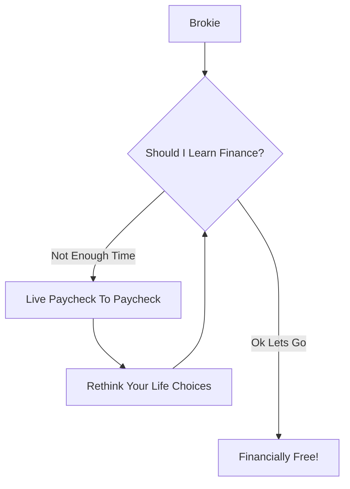

These terms are essential to understand more complex topics that will be discussed in later posts. But why should you even learn finance in the first place? Well let me explain:

 
## Economics  

 

### Supply and Demand
The relationship between the quantity of goods available (supply) and the desire of the population for the goods (demand) is called **Supply and Demand**

When a lot of people want a good or a service (**high demand**) and it is not well available (**low supply**), the good or service will have a **higher price**.
When few people want a good or a service (**low demand**) and it is very available (**high supply**), the good or service will have a **lower price**.

 

### Market Equilibrium
**Market Equilibrium**: The point where supply equals demand, setting the price and quantity in a market.

  When the price of an item $\downarrow$, the number of items sold $\uparrow$.

  When the price of an item $\uparrow$, the number of items sold $\downarrow$.  

  Profit is calculated as:  
 
  $$
  \begin{equation}
  \text{Profit} = \text{Number of items sold} \times \text{Price of item} \times \text{Profit margin}
  \end{equation}
  $$  
 
  Suppliers will continue producing as long as they can sell the good at a price that exceeds the cost of producing one more unit (the marginal cost of production). Buyers will keep purchasing as long as the satisfaction they gain from consuming the good is greater than the price they pay (the marginal utility of consumption). If prices rise, new suppliers will be attracted to the market, increasing supply until the market reaches equilibrium again. Conversely, if prices fall, suppliers who can't cover their costs will exit the market.

  Because of this,  stabilize at what is known as **Market Equilibrium**.
 

### GDP

**GDP (Gross Domestic Product)**: The total value of goods and services produced within a country in a specific period (usually one year). These are examples of the **GDP** of countries.
 

| Country    | GDP (trillion USD) |
| -------- | ------- |
| USA  | $25.44    |
| China    | $17.96    |
| France    | $2.78    |
| Italy    | $2.05    |
| Canada | $2.14     |

 

The **GDP** of a country gives a good indication of the size of an economy and how well it is performing

 

### Inflation
**Inflation**: The rate at which the price of a diversified basket of goods is increasing.

  For example, if you calculate the price of a basket of goods (e.g., apple, gas, tissue, Big Mac, and 100 more items) in 2023 and it costs you 10,000`$`, and then you recalculate the price of the same basket in 2024 and it costs 10,400`$`, you can calculate **inflation** as follows:  
   
  $$
  \begin{equation}
  \text{Inflation} = \frac{\text{Price in year } n - \text{Price in year 0}}{\text{Price in year 0}} 
  \end{equation}
  $$  

  So, for this example:  

  $$
  \begin{equation}
  \text{Inflation} = \frac{10400 - 10000}{10000} = 0.04 \text{ or } 4\%
  \end{equation}
  $$  

  **Inflation** is usually reported annually.

 
## Finance

### Interest Rate
An Interest Rate it the percentage charged by **lenders** to **borrowers** for the use of money. When you borrow money, the amount you initially borrow is called the **principal**. The interest is the additional amount that you owe the lender (fee for using their money)
**Simple interest**:  
 
$$
\begin{equation}
\text{Amount due after } n \text{ years} = \text{Principal} \times (1 + \text{Interest Rate} \times n)
\end{equation}
$$  

**Compound interest**: 
 
$$
\begin{equation}
\text{Amount due after } n \text{ years} = \text{Principal} \times (1 + \text{Interest Rate})^n
\end{equation}
$$
 
- **Example 1**: I am a bank that is ready to lend you $1000 at a 6% interest rate annually with simple interest. 

$$
\begin{equation}
\text{Principal} = 1000\$\\\
\text{Amount due after } n \text{ years} = 1000\$ \times (1 + 0.06 \times n)
\end{equation}
$$  
 

| Year (n) | Interest | Total Amount Due |
|----------|----------|------------------|
| 0        | $0       | $1000            |
| 1        | $60      | $1060            |
| 2        | $120     | $1120            |
| 3        | $180     | $1180            |
| 4        | $240     | $1240            |
| 5        | $300     | $1300            |

 
- **Example 2**: I am a bank that is ready to lend you $1000 at a 6% interest rate annually with compound interest.
Principal = $1000  
$$
\begin{equation}
\text{Amount due after } n \text{ years} = 1000 \times (1 + 0.06)^n
\end{equation}
$$  
 

| Year (n) | Interest | Total Amount Due |
|----------|----------|-------------------|
| 0        | $0       | $1000.00          |
| 1        | $60.00   | $1060.00          |
| 2        | $123.60  | $1123.60          |
| 3        | $191.02  | $1191.02          |
| 4        | $262.48  | $1262.48          |
| 5        | $338.23  | $1338.23          |

 

**Remark**: The difference between these two examples is that Example 1 uses simple interest whereas Example 2 uses compount interests. Notice that compound interests grow faster than simple interests.